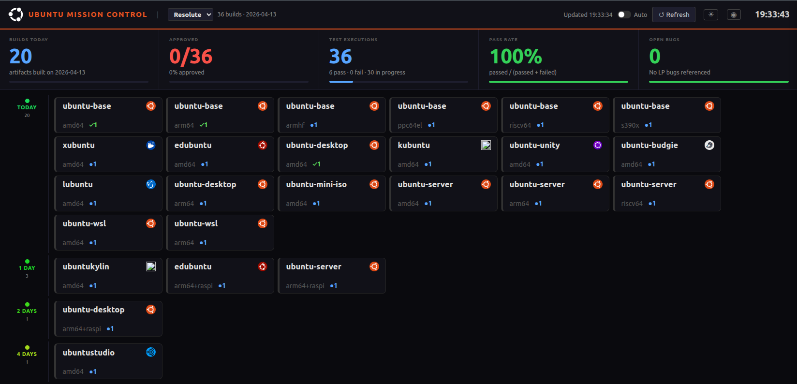
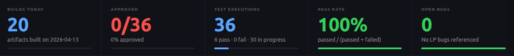
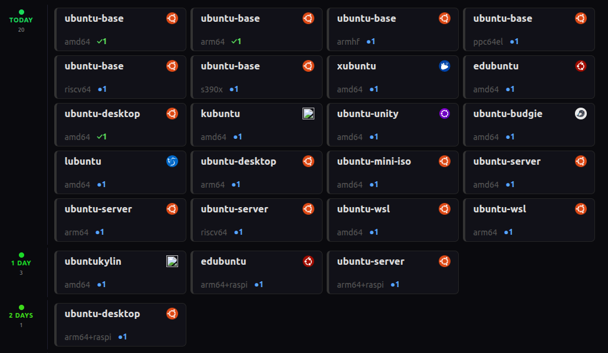
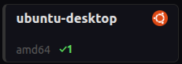
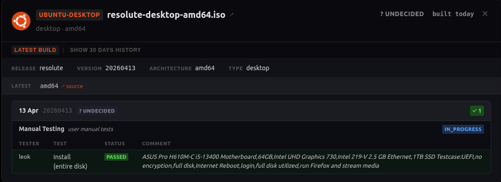
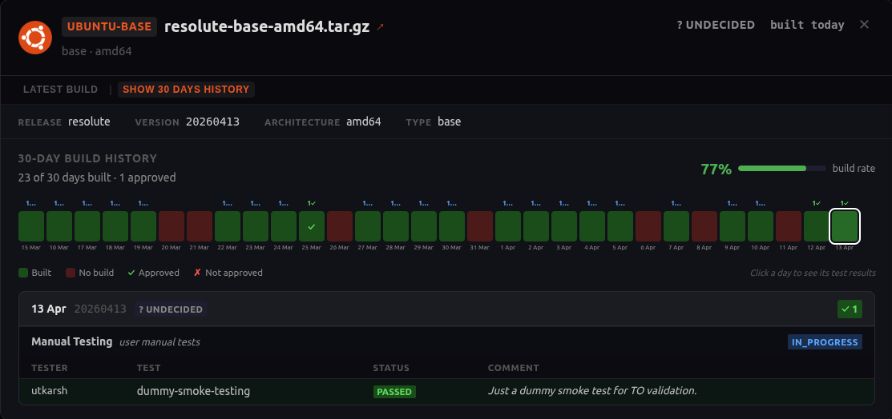
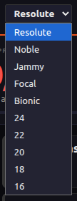
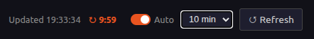

# Feature Guide

Detailed feature reference for Ubuntu Mission Control.

## Dashboard Overview

## Feature Details

- **KPI summary row** - Live aggregate counts of approved, failed, in-progress, and untested artifacts across the dashboard.

  

- **Product grid** - Current list of built artifacts grouped in swimlanes by build date for quick freshness visibility.

  

- **Product card status** - Each card shows product name, architecture, flavor logo, and test status. Cards are green when approved and red when rejected for the current release.

  

- **Product detail modal** - Clicking a card opens detailed build and test information.

  

- **Product 30-day history** - The SHOW 30 DAYS HISTORY tab displays 30-day testing and build success metrics.

  

- **Release selector** - Switch between tracked Ubuntu releases. Automatically renders as a dropdown when multiple releases are configured.

  

- **Auto-refresh control** - Configurable polling interval with a live countdown timer and manual refresh action.

  

- **Three-phase progressive loading** - Artifact cards render first, then test execution chips, then detailed test result and bug reference counts.

- **Launchpad bug extraction** - Launchpad bug numbers are parsed from structured issues and freeform test result comments.

- **Incremental state diffing** - Background refresh updates only changed cards to reduce full-page flicker.

## Related Documentation

- [Project README](../README.md)
- [Architecture and Design](../DESIGN.md)
- [Test Observer API Notes](../TEST_OBSERVER_API.md)
